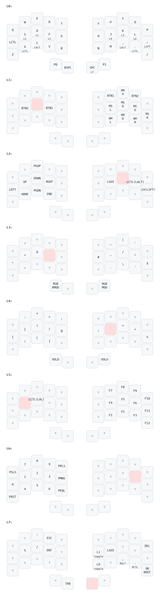
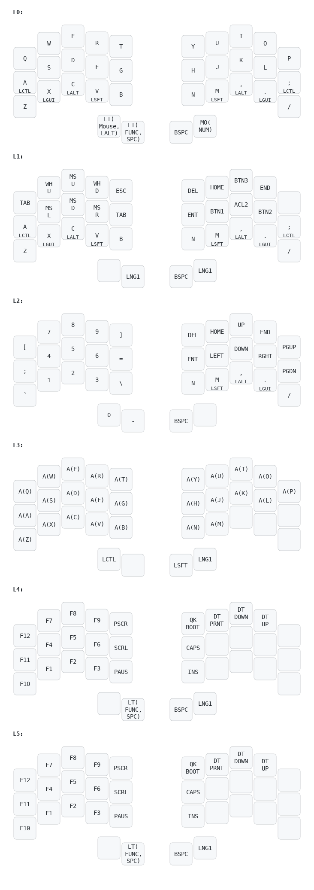

# The keyboard

This layout is made almost entirely from [miryoku](https://github.com/manna-harbour/miryoku). However, I used fewer layers and reduced 36 keys to 34.

> As little as possible, as simple as possible, as easy as possible to memorize

Replaced the Ctrl, GUI, Alt, and Shift keys with home mod row. A combo function was added by removing some RGB animations of the bm40's keyboard to free up memory. If animation is not removed, it is because there is not enough memory to compile. Added code that uses RGB matrix animation so that you can see at a glance which layer is being used, and you can move faster by increasing the speed of the mouse key. 

And because I'm Korean, a combo for Korean and English keyboard conversion has been added, but if you don't need it, you can delete it.

- Flash:

  `qmk flash -kb ferris/sweep -km type1`

# Keymap

## default

## type1

